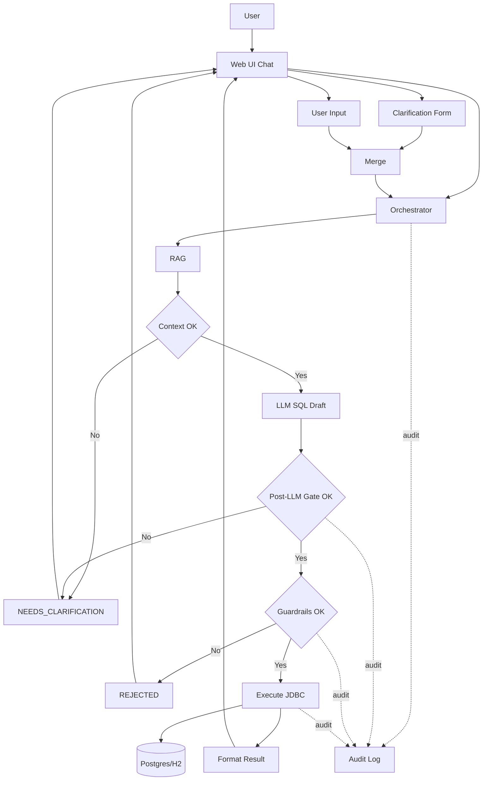

# Phase 1 Architecture Chart

This is a compact readability-first view of the Phase 1 flow.

```mermaid
%%{init: {"flowchart": {"useMaxWidth": true, "nodeSpacing": 40, "rankSpacing": 50}, "themeVariables": {"fontSize": "16px"}} }%%
graph TD
    U[User] --> UI[Web UI Chat]
    UI --> O[Orchestrator]
    O --> R[RAG]
    R --> C{Context OK}

    C -->|No| N[NEEDS_CLARIFICATION]
    N --> UI
    UI --> CF[Clarification Form]
    UI --> CI[User Input]
    CF --> M[Merge]
    CI --> M
    M --> O

    C -->|Yes| L[LLM SQL Draft]
    L --> G1{Post-LLM Gate OK}
    G1 -->|No| N
    G1 -->|Yes| G2{Guardrails OK}

    G2 -->|No| RJ[REJECTED]
    RJ --> UI

    G2 -->|Yes| X[Execute JDBC]
    X --> DB[(Postgres/H2)]
    X --> F[Format Result]
    F --> UI

    O -.audit.-> A[Audit Log]
    G1 -.audit.-> A
    G2 -.audit.-> A
    X -.audit.-> A
```
