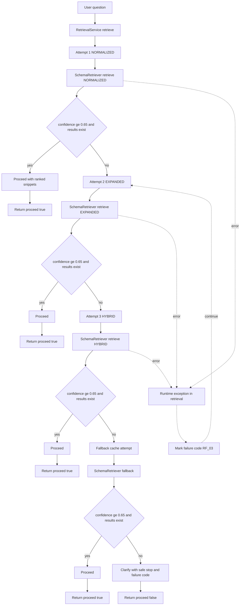

# RetrievalService Diagram

This diagram shows how `RetrievalService` performs multi-step retrieval, confidence checks, and safe fallback.

## Verbal Section

1. `RetrievalService` starts with a normalized query to improve match consistency.
2. If confidence is low or no chunks are found, it retries with alias expansion (`EXPANDED`).
3. If still weak, it performs a hybrid retrieval attempt (`HYBRID`).
4. If all three attempts fail to meet threshold, it falls back to cached/curated context (`FALLBACK_CACHE`).
5. Every attempt is logged with mode, confidence, failure code, and result count.
6. If any attempt reaches threshold and returns chunks, service returns `proceed = true` with ranked snippets.
7. If all attempts remain weak, service returns `proceed = false` with a safe clarification message.
8. Failure codes communicate why retrieval is blocked:
   - `RF_01`: no context found
   - `RF_02`: low confidence
   - `RF_03`: retrieval execution error
   - `RF_04`: post-validation recovery path triggered

## Current Wiring Note

`recoverFromValidationFailure` exists in `RetrievalService`, but it is currently only used in unit tests and is not called from the production orchestrator flow.
