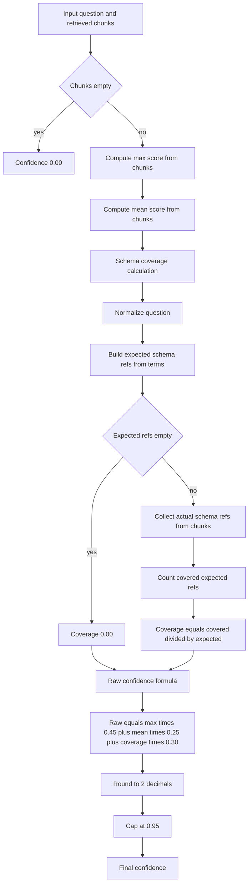

# Confidence Calculation Diagram

This diagram explains how RetrievalService computes confidence from retrieved chunks.

## Verbal Section

1. If no chunks are retrieved, confidence is immediately 0.00.
2. If chunks exist, the service computes two score statistics:
   - max score across chunks
   - mean score across chunks
3. The service also computes schema coverage from the question and retrieved schema references.
4. To compute coverage, the question is normalized first.
5. Expected schema references are inferred from keywords in the question:
   - customer, clients, region maps to customers
   - order, revenue, sales, spending maps to orders
   - product maps to products and order_items
6. If no expected references are inferred, coverage is 0.00.
7. Otherwise, coverage is covered_expected_refs divided by total_expected_refs.
8. Raw confidence is combined with weighted factors:
   - 45 percent from max score
   - 25 percent from mean score
   - 30 percent from schema coverage
9. The result is rounded to 2 decimals and capped at 0.95.
10. This final confidence is then used by retrieval flow to decide proceed or clarify.
